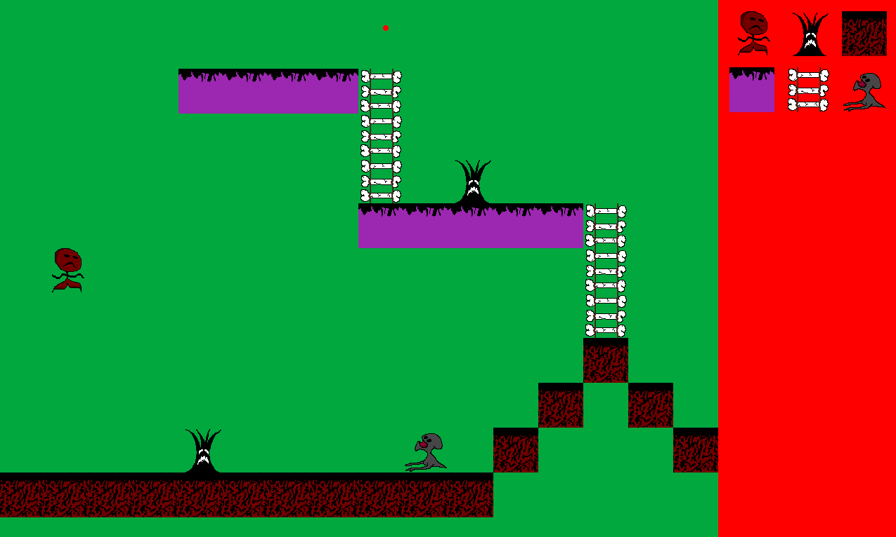

# 🎮 Mr. Squiggles

_A 2D platformer built using C++17 and SFML 3.0.0._

> A sad man with noodles for arms attempts to escape an uninspiring 2D-Platformer world so the guy developing the game can learn new programming skills ;).

---

## 📖 Table of Contents

- [About the Game](#about-the-game)
- [Features](#features)
- [Screenshots & GIFs](#screenshots--gifs)
- [Controls](#controls)
- [Installation & Running](#installation--running)
- [Technologies Used](#technologies-used)
- [Credits](#credits)
- [License](#license)

---

## 🕹️ About the Game

Mr. Squiggles is no ordinary 64x64 pixel protagonist. He's sad...because that's how I drew the sprite initially and decided to keep it that way. He is traversing through a Halloween world, fighting monsters uglier than himself, evading highly dangerous traps, and collecting little trinkets along the way.

---

## 🚀 Features

Here are some of the highlights of the game:

- ✅ Smooth 2D movement
- ✅ Tile-based AABB (axis-aligned bounding box) collision system
- ✅ Enemy AI (patrol, chase, attack) (TODO)
- ✅ Custom animation system (run, idle, jump, crouch, dash, death, and more!)
- ✅ Parallax scrolling for immersive world building (TODO)
- ✅ Scene management system
- ✅ Pause and settings menu
- ✅ Audio with SFML Sound & Music
- ✅ Entity-Component-System (ECS) architecture for modularity
- ✅ Entity-Component Memory Pooling to take advantage of cache-coherency
- ✅ Kanban (Jira) for project management

---

## 📸 Screenshots & GIFs

> Store your media in a `/media/` folder or link to hosted images. (TODO)

### Jira
[Jira](https://sirnewblet.atlassian.net/jira/software/projects/SAD/boards/1)

### 🎬 Gameplay

### 🧱 Level Editor Preview

---

## 🎮 Controls

| Action         | Key            |
|----------------|----------------|
| Move Left      | A / ←          |
| Move Right     | D / →          |
| Jump           | Space / ↑      |
| Attack         | Enter          |
| Interact       | N/A            |
| Pause/Menu     | Esc            |

---

## 💻 Installation & Running

### 🧰 Requirements

- C++17 or newer compiler
- [SFML 3.0.0](https://www.sfml-dev.org/download.php)
- Git (to clone the repo)
